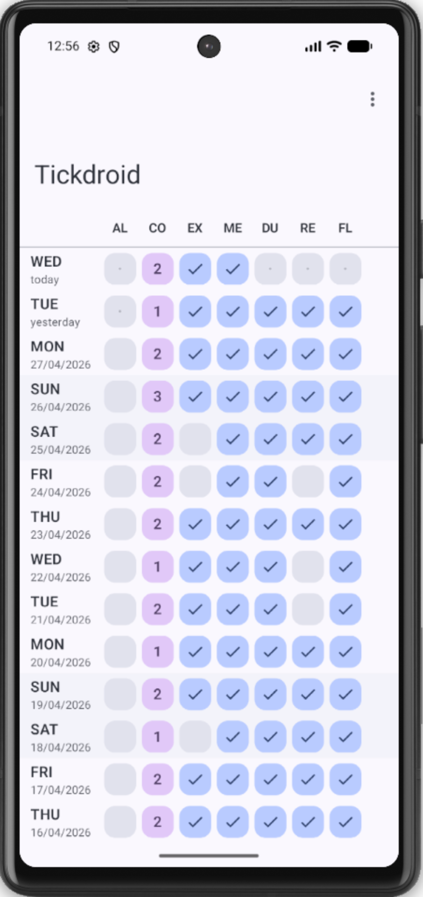
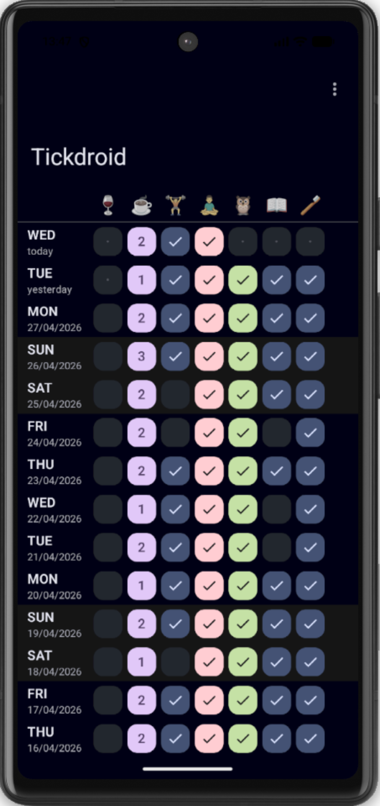
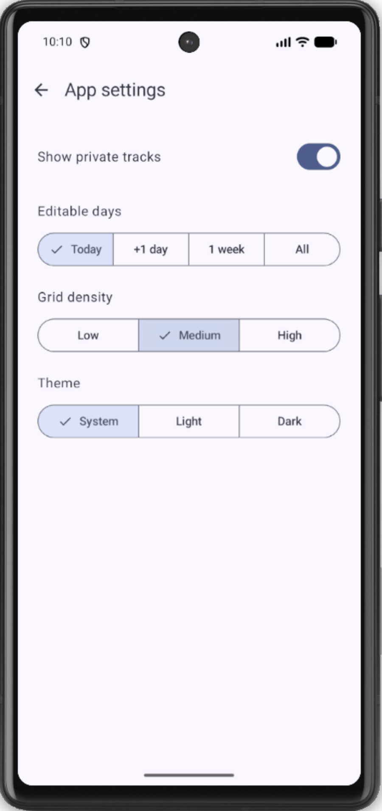
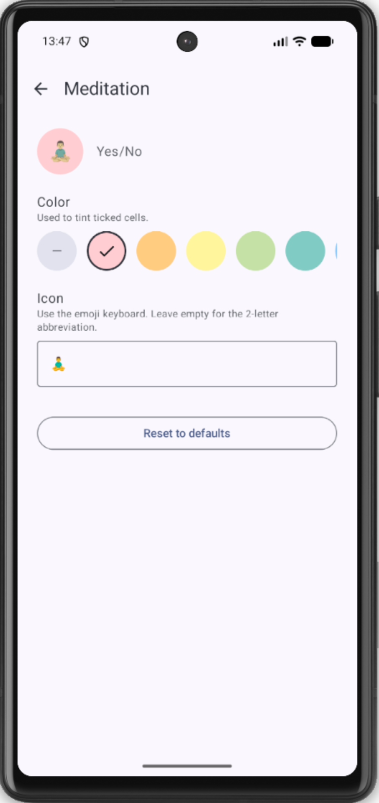

# Tickdroid

Tickdroid is an Android companion app to the Nextcloud application [Tickbuddy](https://github.com/martinhammer/tickbuddy). Tickbuddy and Tickdroid were inspired by the "one-bit journal" Android app [Tickmate](https://f-droid.org/en/packages/de.smasi.tickmate/). Please note that Tickdroid cannot be used as a standalone application, as it relies on the Tickbuddy/Nextcloud back-end.

The application enables users to record whether a specific event has occurred or not on daily basis. The events can be arbitrary habits or occurrences such as doing sports, smoking, taking out trash, etc. These events are tracked over time, and longer term statistics and patterns can be analysed. The idea is to encourage healthy habits, get over bad ones, or simply to keep track of things over time.

### Features
Some of the key features which already exist:
* Authenticate against Nextcloud server and verify that Tickbuddy is installed
* Two-way sync with Tickbuddy back-end
* Screen to display/edit tracks and ticks
* Setting to control editable days
* System / light / dark theme setting
* Setting for grid density, i.e. size of the cells
* Custom colours and icons for tracks
* Landscape mode is handled gracefully

Planned features:
* Further UI enhancements and polish
* Possibility of localization 
* Package and publish on F-Droid app store
* ...and more once these goals are achieved

### Motivation

This is a personal hobby project which I am using to learn about Nextcloud and Android app development and AI-assisted development. Significant portion of the code has been written by Claude Code. 

At the time of starting this project there is no equivalent app in the Nextcloud ecosystem, and the Tickmate Android application is no longer actively maintained. I am now actively using Tickbuddy and Tickdroid for my personal tracking, and would be happy if others find it useful.

### Found a bug?

Feel free to get in touch and/or submit an issue.

### Screenshots

Main screen - light theme, default colours and headings

Main screen - dark theme, with emojis as headings and some custom colours

App settings screen

Track settings screen - assigning a custom colour and emoji icon

